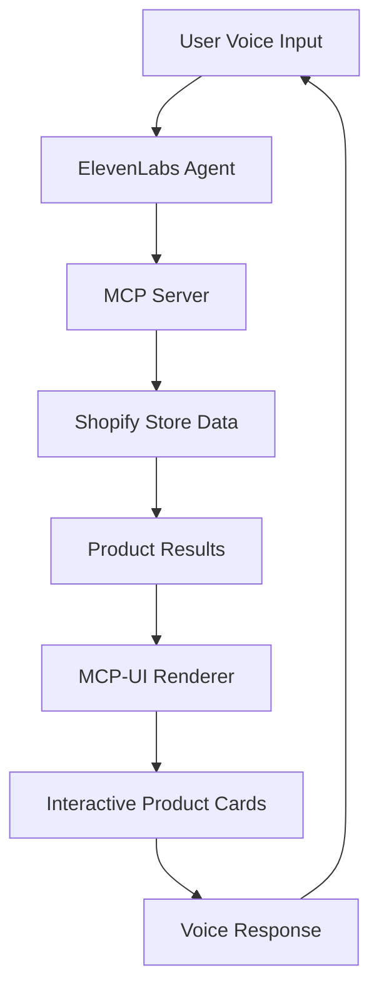

# Eleven Shopping


> **Your personal AI shopping assistant for any Shopify store. Just describe the product you want, by name, style, or details, and I'll find it for you.**

A cutting-edge conversational commerce platform powered by [ElevenLabs Agents](https://elevenlabs.io/agents) and [MCP-UI](https://mcpui.dev/), demonstrating the future of voice-enabled shopping experiences.

## ✨ Features

- 🎙️ **Natural Voice Conversations** - Talk to your AI shopping assistant like a human
- 🛍️ **Intelligent Product Discovery** - Describe what you want in natural language
- 🌍 **Multi-language Support** - Shop in 32+ languages with automatic detection
- 📱 **Responsive Design** - Beautiful UI that works on all devices
- 🔒 **Privacy-First** - Clear consent flow and data handling transparency
- ⚡ **Real-time Processing** - Ultra-low latency voice interactions
- 🎨 **Modern UI/UX** - Sleek design with smooth animations and transitions

## 🚀 Live Demo

Experience the future of shopping at [eleven.shopping](https://eleven.shopping)

## 🛠️ Tech Stack

- **Frontend**: Next.js 14, React, TypeScript, Tailwind CSS
- **Voice AI**: ElevenLabs Agents Platform
- **UI Components**: Radix UI, Framer Motion
- **Product Data**: MCP (Model Context Protocol) integration
- **Deployment**: Vercel

## 📋 Prerequisites

Before you begin, ensure you have:

- Node.js 18+ installed
- An [ElevenLabs](https://elevenlabs.io) account with API access
- A Shopify store or access to product data via MCP

## ⚙️ Setup & Installation

### 1. Clone the Repository

```bash
git clone https://github.com/thorwebdev/conversational-commerce.git
cd conversational-commerce
```

### 2. Install Dependencies

```bash
pnpm install
# or
npm install
# or
yarn install
```

### 3. Configure ElevenLabs Agent

1. **Create a new agent** in your [ElevenLabs Dashboard](https://elevenlabs.io/agents)
2. **Add MCP server integration**:
   - Protocol: SSE (Server-Sent Events)
   - URL: `https://mcpstorefront.com/?store=allbirds.com&mode=prompt`
   - This connects your agent to Shopify product data
3. **Copy your Agent ID** from the dashboard

### 4. Environment Variables

Create a `.env.local` file in the root directory:

```env
# ElevenLabs Configuration
AGENT_ID=your_agent_id_here
ELEVENLABS_API_KEY=your_api_key_here

# Optional: Custom store configuration
STORE_URL=your-shopify-store.myshopify.com
```

### 5. Run the Development Server

```bash
pnpm dev
# or
npm run dev
# or
yarn dev
```

Open [http://localhost:3000](http://localhost:3000) to see your conversational commerce platform in action!

## 🎯 How It Works

### Voice-First Shopping Experience

1. **Start Conversation**: Click "Start shopping" to begin your voice session
2. **Natural Interaction**: Describe what you're looking for in plain English
3. **AI Understanding**: The agent processes your request using advanced NLP
4. **Product Discovery**: Relevant products are fetched and displayed dynamically
5. **Seamless Checkout**: Complete purchases through integrated payment flows

### Technical Architecture



## 🎨 Key Components

### ConversationalCommerce

The main component orchestrating the entire shopping experience with:

- Voice conversation management
- Real-time audio processing
- Dynamic UI state transitions
- Product result rendering

### Voice Agent Integration

- WebRTC-based real-time communication
- Multi-language support with automatic detection
- Natural turn-taking and interruption handling
- Custom tool integrations for e-commerce actions

### Product Discovery

- MCP (Model Context Protocol) for structured data access
- Dynamic product card rendering
- Interactive shopping flows
- Seamless checkout integration

## 🔧 Customization

### Adding Your Own Store

Replace the MCP server URL with your store's endpoint:

```typescript
// In your agent configuration
const mcpServerUrl =
  "https://mcpstorefront.com/?store=your-store.com&mode=prompt";
```

### Custom Voice Personalities

Configure different agent personalities in your ElevenLabs dashboard:

- Adjust tone and speaking style
- Set conversation context and behavior
- Define custom responses and flows

### UI Theming

Customize the appearance using Tailwind CSS:

```css
/* In globals.css */
:root {
  --primary-color: #your-brand-color;
  --accent-color: #your-accent-color;
}
```

## 📚 API Reference

### Environment Variables

| Variable             | Description              | Required |
| -------------------- | ------------------------ | -------- |
| `AGENT_ID`           | Your ElevenLabs Agent ID | ✅       |
| `ELEVENLABS_API_KEY` | Your ElevenLabs API key  | ✅       |
| `STORE_URL`          | Custom Shopify store URL | ❌       |

### Key Endpoints

- `GET /api/webrtc-token` - Retrieves conversation token for voice session
- `GET /api/test-env` - Validates environment configuration

## 🚀 Deployment

### Deploy to Vercel

[](https://vercel.com/new/clone?repository-url=https://github.com/thorwebdev/conversational-commerce)

1. Click the deploy button above
2. Add your environment variables in the Vercel dashboard
3. Deploy and share your conversational commerce platform!

### Manual Deployment

```bash
# Build the application
pnpm build

# Start production server
pnpm start
```

## 🤝 Contributing

We welcome contributions! Please see our [Contributing Guide](CONTRIBUTING.md) for details.

1. Fork the repository
2. Create your feature branch (`git checkout -b feature/amazing-feature`)
3. Commit your changes (`git commit -m 'Add some amazing feature'`)
4. Push to the branch (`git push origin feature/amazing-feature`)
5. Open a Pull Request

## 📄 License

This project is licensed under the MIT License - see the [LICENSE](LICENSE) file for details.

## 🙏 Acknowledgments

- **[ElevenLabs](https://elevenlabs.io)** - For providing the incredible voice AI technology
- **[MCP-UI](https://mcpui.dev/)** - For the seamless product data integration
- **[Vercel](https://vercel.com)** - For the amazing deployment platform
- **[Shopify](https://shopify.com)** - For the e-commerce infrastructure

## 📞 Support

- 📧 Email: [support@eleven.shopping](mailto:support@eleven.shopping)
- 💬 Discord: [Join our community](https://discord.gg/elevenlabs)
- 📖 Documentation: [ElevenLabs Agents Docs](https://elevenlabs.io/docs/agents)
- 🐛 Issues: [GitHub Issues](https://github.com/thorwebdev/conversational-commerce/issues)

---

<div align="center">

**Built with ❤️ by the ElevenLabs community**

[Website](https://eleven.shopping) • [Demo](https://eleven.shopping) • [Documentation](https://elevenlabs.io/docs) • [Community](https://discord.gg/elevenlabs)

</div>
